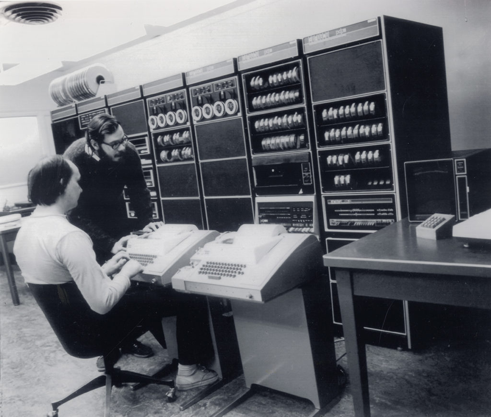

# Introduction to the Command Line
Thursday, Sept 15, 2022

## Agenda

- [Paul Ford, "What is Code?"](#what-is-code)
- [What is the Command Line?](#what-is-the-command-line)
- [Practicing the command line](#lets-practice-command-line-commands)
	- [Creating text files](#creating-text-files-and-directories)
	- [Working with text files](#working-with-files-and-texts)
	- [Analyzing text files](#analyzing-text-files)
- [In-Class Exercises](#in-class-exercises) 

---

## What is Code?

> "A computer is a clock with benefits."  
> ––Paul Ford, "What is Code?"
> [https://www.bloomberg.com/graphics/2015-paul-ford-what-is-code/#lets-begin](https://www.bloomberg.com/graphics/2015-paul-ford-what-is-code/#lets-begin/)

**Code**

>"A sequence of symbols (using typical keyboard characters, saved to a file of some kind) that someone typed in, or copied, or pasted from elsewhere."  
> ––Paul Ford, "What is Code?"
> [https://www.bloomberg.com/graphics/2015-paul-ford-what-is-code/#how-does-code-become-software](https://www.bloomberg.com/graphics/2015-paul-ford-what-is-code/#how-does-code-become-software)

**Algorithms**

> "'Algorithm' is a word writers invoke to sound smart about technology. Journalists tend to talk about 'Facebook’s algorithm' or a 'Google algorithm,' which is usually inaccurate. They mean 'software.' Algorithms don’t require computers any more than geometry does."  
> "An algorithm solves a problem, and a great algorithm gets a name."  
>  ––Paul Ford, "What is Code?" 
> [https://www.bloomberg.com/graphics/2015-paul-ford-what-is-code/#what-is-an-algorithm](https://www.bloomberg.com/graphics/2015-paul-ford-what-is-code/#what-is-an-algorithm)

**Programming Languages**

>"A programming language is a system for encoding, naming, and organizing algorithms for reuse and application. It’s an algorithm management system."  
>  "Instead of worrying about where the words are stored in memory and having to go character by character, programming languages let you think of things like strings, arrays, and trees."  
>    ––Paul Ford, "What is Code?"   
> [https://www.bloomberg.com/graphics/2015-paul-ford-what-is-code/#what-is-an-algorithm](https://www.bloomberg.com/graphics/2015-paul-ford-what-is-code/#what-is-an-algorithm)

## What is the Command Line? ## 

AKA bash, the terminal, shell

- A UNIX-based, text-based way of interacting with your computer! This is one way to interact with files, execute code, and analyze files.
- It's written in *plain text*, which makes the commands human-readable.


Dennis Ritchie (left) and Ken Thompson (right) working on the DEC PDP-11, part of the early MULTICS project that became UNIX, [Computer History Museum](https://www.computerhistory.org/collections/catalog/102685442)

## Let's practice command line commands!


In the [*Programming Historian* tutorial](https://programminghistorian.org/en/lessons/intro-to-bash) you learned the following commands:

FOR MACS: 
- `pwd`:  path of working directory. This is the "tell me what folder I am in right now" 
- `cd [filepath]`: change directory, move into the folder called "filepath" 
- `cd ..`: change directory by moving up one level in the folder structure to a parent directory
- `ls`: list the files and folders in your current directory 
- `mkdir [directoryname]`: make a director called "directory-name"
- `man [commandname]`: manual. This is the help function. Type man command and it will tell you what that command does
- `cp [original-filename] [copied-filename]`: copy file
- `rm [filename]`: remove file:
- `mv [original-filename] [new-filename]`: move or rename a file or folder
- `cat [filename]`: show all the contents of a file, eg cat filename
- `head[filename]`: shows you the first 10 lines. Can be used with a flag and a number to show the first however many lines (eg `head -50 [filename]` to show the first 50 lines)
- `tail`: shows you the last 10 lines. Can be used with a flag and a number to show the last however many lines (eg `tail -50 [filename]`)


FOR WINDOWS

- `gc [filename] -head 10`: shows you the first 10 lines. Can be used with a flag and a number  to show the first however many lines (eg `gc [filename] -head 50`, which shows the first 50 lines)
- `gc [filename] -tail 10`: shows you the last 10 lines. Can be used with a flag and a number  to show the last however many lines (eg `gc [filename] -tail 50`, which shows the last 50 lines)


---
Navigate to the webpage with today's [introduction to the command line lesson](https://github.com/sceckert/IntroDHFall2022/blob/main/_week2/introduction-to-the-command-line.md)

Open the [command line cheatsheet](https://github.com/sceckert/IntroDHFall2022/blob/main/_week2/command-line-cheat-sheet.md). This cheat sheet is yours to keep, modify, add to, re-use! Copying is encouraged in programming (though it's important to get in the habit of practicing typing the commands yourself to get used to the syntax)

### Creating text files and directories

1. Open up your terminal
2. Use `pwd` to tell us where we are
3. Use `mkdir workspace` to create a directory (a folder) called  "workspace", and then use `mkdir ../practice` to make a directory called "practice" inside of "workspace" [*NOTE: if you are using Windows, your slash will point the other way!*]  
Your directory structure should look like:
```
--workspace
----------+practice
```
4. `cd` into the directory called "practice" [**What should we type?**]
5. Use a new command, called **`touch`** to create a new file called greetings.txt in workspace:
` touch ../an_empty_file.txt` 
[*NOTE: if you are using Windows, your slash will point the other way!*]
6. `cd`  back into "workspace." 
7. Use `echo` and `>` to create a text file: 
``` 
echo """
Hello! 
Hi!
Hey!
Greetings, Intro DH!
""" > greetings.txt
````
8. `cat greetings.txt` our file to check inside

> ***TIPS & TRICKS Interlude***
> 
> Try typing `cat g` and hit `tab`. 
> What happens?  
> Now try hitting the `Up Arrow`. 
> What happens?

9. Now try 
``` 
echo """
Hello, again! 
Hi, again!
Hey, again!
Greetings (again) Intro DH!
""" >> greetings.txt
````
10. Check your file again with `cat greetings.txt`  What do we notice?
11. List the files we have in this directory using `ls`

---
---


### Working with files and texts ##

All Unix commands have **a syntax: transitive verb -> adverb ->  object**

1. Type `head -1 greetings.txt`  
	- *For Windows*, type `gc greetings.txt -head 1`
2. This command can be roughly parsed as "show me" (`head`) only the first line (`-1`) of my file "greetings.txt" (`greetings.txt`)


#### Count words, lines, and characters (For Macs) 

 **`wc`** is a command that allows you to count words and lines in a text file. It can be used with flags.

1. Use  `wc -w greetings.txt` to count the number of words in `greetings.txt`.
	-  In the statement above, `wc` is our verb, while the flag `-w` is our adverb and `greetings.txt`  is the object
2. Use `wc -l` to count the number of lines in `greetings.txt`

---

####  Count words, lines, and characters (For Windows)

**`gc [filename] | Measure-Object`** uses the command **`gc`** with the command **`Measure-Object`** allows you to count words and lines in a text file  (We'll explain that `|` in a minute!)

1. Use `gc greetings.txt | Measure-Object -Word` to count the number of words in `greetings.txt`
2. Now use the `-Line` flag with the command above count the number of lines in `greetings.txt`

---
---

### Analyzing text files

#### Searching inside a text file (For Macs) 


**`grep "search term" [filename]`**: allows you to search for a `"search term"` in a file output lines that match a search term or pattern

1. Type `grep "Intro DH" greetings.txt`
2. Type `grep "Intro DH" -n greetings.txt`
	- The `-n` flag is one of many flags we can use to soup up our search. Here, this outputs the corresponding line numbers
2. Now try `grep "Intro DH" -B 1 -A 1 -n --color greetings.txt`
	- What just happened?
	- The `-B`  and `-A` flags will give the number of lines before (-B) or after (-A). Here, we said to display one line before and one line after our search term. This gives us the context (the 2 lines around a term). The `--color` flag highlighted our search term or search phrase.

What if we wanted to search for more than one term?


We can separate a list of key search terms like this:

1. Type: `grep "hi\|hey" -i --color -n  greetings.txt`
2. Notice that we can add additional search terms using the `\|` symbol to separate them


---


#### Searching inside a text file (For Windows)

**`gc [filename] | Select-String -Pattern "search term"`**: takes the `gc` command and pipes it to a command called `Select-String`, which searches for lines that include the search term. 

1. Type `gc  greetings.txt | Select-String -Pattern "Intro DH"`
2. Type `gc  greetings.txt | Select-String -Pattern "Intro DH" -AllMatches` 
	- The `-AllMatches` flag is one of many flags we can use to soup up our search. This makes sure that we catch any instances where our search term appears twice on a line
2. Now try `gc  greetings.txt | Select-String -Pattern "Intro DH" -Context 1,1` 
	- What just happened?
	- The `-Context [number, number]` flag will give the number of lines before and after the line with the search term. Here, we said to display one line before and one line after our search term. This gives us the context (the 2 lines around a term). 

What if we wanted to search for more than one term?


We can separate a list of key search terms like this:

1. Type: `gc greetings.txt | Select-String -Pattern "(hi)|(hey)"` 
2. Notice that we can add additional search terms using the `|` symbol and parentheses to separate them

---

### Pipes (`|`),  Wildcards (`*`), and Redirects (`>`)

The command `|` is a pipe. It  takes the **output** of one command and passes it on as the input of another. It can be used to string together a series of commands.

#### For Macs:

1. Try `grep "Hello" greetings.txt  | wc -w`

The character **`*`** is a wildcard. It tells the program to search for all file paths in the current working directory.

2. Try `grep "Hello" *` 

We've already seen the redirect (`>`) and append (`>>`) characters. 

- The redirect command `>` takes the output of a command and puts it in a file. It an be used in conjunction with other commands, like `echo`, to take an input and write it to file. Eg `echo "Here is some text" > filename.txt` will create a new file called "filename" containing the enclosed phrase, or **overwrite** an existing file.
- The append command `>>` can be used in conjunction with other commands, like `echo`, to take an input and append it to a file. Eg `echo "Here is some text" >> filename.txt` will add the text "Here is some text" to the file filename.txt, or create a new file, if it does not already exist.

---

#### For Windows:

1. Try `gc greetings.txt  | Select-String -Pattern "Hello" |  Measure-Object -Word`

The character **`*`** is a wildcard. It tells the program to search for all file paths in the current working directory.

2. Try `gc .\*.txt  | Select-String -Pattern "Hello" | Measure-Object -Word`

We've already seen the redirect (`>`) and append (`>>`) characters. 

- The redirect command `>` takes the output of a command and puts it in a file. It an be used in conjunction with other commands, like `echo`, to take an input and write it to file. Eg `echo "Here is some text" > filename.txt` will create a new file called "filename" containing the enclosed phrase, or **overwrite** an existing file.
- The append command `>>` can be used in conjunction with other commands, like `echo`, to take an input and append it to a file. Eg `echo "Here is some text" >> filename.txt` will add the text "Here is some text" to the file filename.txt, or create a new file, if it does not already exist.

---
---

## Any questions??

---
---

## In-Class Exercises

Open the [in-class exercises](https://github.com/sceckert/IntroDHFall22/blob/main/_week2/in-class-exercises.md) and work through them with your partner.