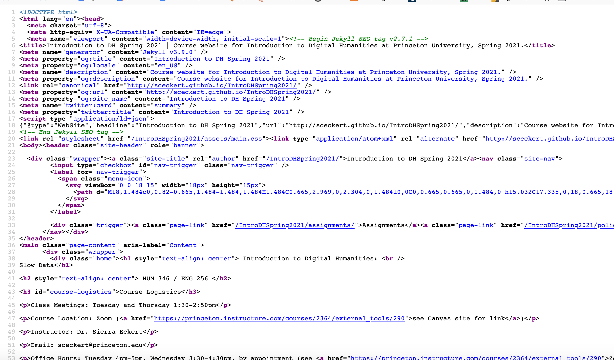
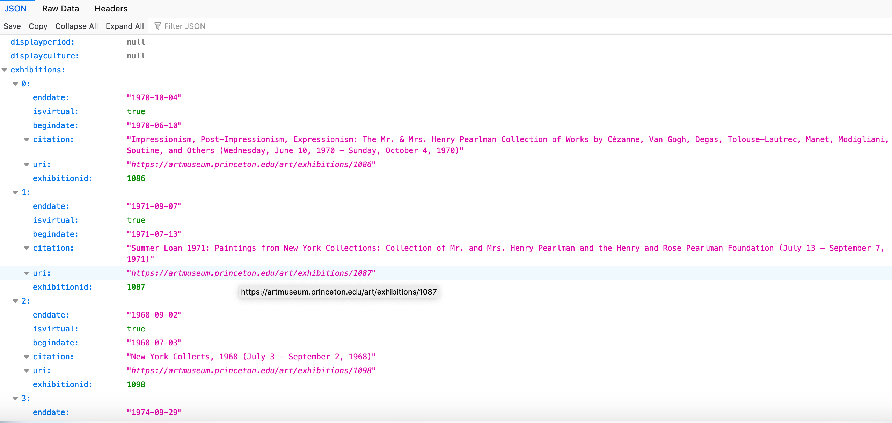

# Advanced tips for fetching data from the web

Table of Contents:

- [Regex: how to parse and process text files)](#regex-how-to-parse-and-process-text-files)
- [Using OpenRefine for webscraping: Advanced Tips] 
	- [Forms of data you might get from an API]
	- [How to handle each form of data in OpenRefine]
- [Using Beautiful Soup for webscraping]

---

### Regex: how to parsing and process text files

What if, in our [in-class exercise](https://github.com/sceckert/IntroDHSpring2021/blob/main/_week6/introduction-to-webscraping-and-open-refine.md), we had wanted to start with a list of albums that included punctuation marks or other characters that are stripped away in the Genius URLs? If we tried to generate URLs from the data in that format, we would get an error.

Luckily, there's an easy solution. **Regex**, which stands for "regular expressions" is a shorthand language for patterns in strings of character that can be used to quickly things like remove punctuation and non-alphanumeric characters from a sequence of text. We've already seen a little bit of regular expressions before––way back when we were learning Python and counting word frequencies.

We could use regular expressions to parse our date: For example, say we had this kind of music data:

```
artist, album
Beyoncé, Lemonade
Beyoncé,  Beyoncé
Beyoncé, B'Day
Beyoncé, I Am...Sasha Fierce
```

And we wanted to remove the punctuation marks and special character, so it looked like this:

```
artist, artist_parsed, album, album_parsed
Beyoncé, Beyonce, Lemonade, Lemonade
Beyoncé,  Beyonce, Beyoncé, Lemonade
Beyoncé, Beyonce, B'Day, B-Day
Beyoncé, Beyonce, I Am...Sasha Fierce, I-Am-Sasha-Fierce
```

If we want to preserve the formatting in our spreadsheet, but still be able to extract the artist name and album name in way we could systematically enter into a URL, we could create two new columns, "artist_parsed" and "albumn_parsed" by clicking on the original column and adding a new column based on that column.

In the window that pops up to create each column, we would paste the following expression 

`value.replace(/\W+/, "-")` : 

This is a regular expression that takes in the value in the column and replaces all non-alphanumeric characters (the `/\W+/`) with a "``-``". 


---

## Using OpenRefine for Webscraping: Advanced Tips 

### Forms of data you might get from an API 

There are a few types of data that you might encounter when working with an API:

- HTML
	- Data is stored in elements, which consist of a start **tag** (enclosed in angled brackets), content, and an end tag (enclosed in brackets with a backslash)
	- Tags can contain **attributes**, which provide additional information, like URLS 
	- Attributes usually come in name/value pairs like: name="value"
	- For more, see[ https://www.w3schools.com/html/](https://www.w3schools.com/html/)
	
- JSON
	-  Data is in name/value pairs
	-  Data is separated by commas
	-  Curly braces `{ }`hold objects
	-  Square brackets`[ ]` hold arrays, ie lists of data.
	-  For more, see [https://www.w3schools.com/js/js_json_syntax.asp](https://www.w3schools.com/js/js_json_syntax.asp)
 
- XML 
	- XML data is similar to HTML in that it contains start tags, content, and end tags
	- Like HTML, XML elements can have attributes in name/value pairs, eg dat="12/1/2020"
	- Data contains a `<root>`  with child elements


### How to handle each form of data in OpenRefine

**HTML**: use the GREL (General Refine Expression Language) function : `.parseHtml()` and use the `.select()` operation

- Example - find the first instance of the `p` tag in an HTML document: `value.parseHtml().select('pt')[0].HtmlText()`
- Example - find all instances of the `div.subtitle` tag in an HTML document, and output them as a list separated by "|||": `forEach(value.parseHtml().select("div.subtitle"),e,e.htmlText()).join(" ||| ")`
- For more, see: https://docs.openrefine.org/manual/grelfunctions#format-based-functions-json-html-xml

**JSON**: use the GREL (General Refine Expression Language) function : `.parseJson()` to elect a key name to retrieve the corresponding value from the JSON file
- Example - find the content in (" { 'a' : 1 } ") under the key "a":   `value.parseJson().get("a")`
- Example - find all the values for the date key  and output them as a list separated by "|||": `forEach(value.parseJson().keywords,v,v.date).join("|||")`
- For more, see https://docs.openrefine.org/manual/grelfunctions#format-based-functions-json-html-xml

**XML**: use the GREL (General Refine Expression Language) function : `.parseXml()` and use the `.select()` operation


### Want more tips on using OpenRefine?
The Programming Historian has a tutorial by Evan Peter Williamson on [using OpenRefine to parse data from the web](https://programminghistorian.org/en/lessons/fetch-and-parse-data-with-openrefine)

John Little, at Duke University Libraries, has created a handy workbook on using OpenRefine to collect and parse different kinds of data including working with [HTML data downloaded from an API,](https://libjohn.github.io/openrefine/hands-on-html-parsing.html) and with [JSON data downloaded from an API](https://libjohn.github.io/openrefine/hands-on-web-scraping.html)

https://api.genius.com/search?q=beyonce&access_token=REPLACE-THIS-TEXT-WITH-YOUR-CLIENT-ACCESS-TOKEN


## Using Beautiful Soup for webscrapting

Occasionally you might find that the data you're working with is too big for OpenRefine to handle. This is where Python's Beautiful Soup comes in. [Beautiful Soup](https://www.crummy.com/software/BeautifulSoup/bs4/doc/) is a Python library, which means we can use it within our webwrowser.

The [Beautiful Soup documentation](https://www.crummy.com/software/BeautifulSoup/bs4/doc/#making-the-soup) gives a nice overview of the basic way you'll write something like

``` 
from bs4 import BeautifulSoup

with open("index.html") as filepath:
    soup = BeautifulSoup(filepath, 'html.parser')

soup = BeautifulSoup("<html>a web page</html>", 'html.parser')

print(BeautifulSoup("<html><head></head><body>Sacré bleu!</body></html>", "html.parser"))
```

Beautiful Soup can be used to parse and extract specific elements (ie tags, attributes) from your HTML file.

To learn the basics of how to use the library, read **Jeri Wieringa's ["Intro to Beautiful Soup"](https://programminghistorian.org/en/lessons/intro-to-beautiful-soup)**. Note that we can run all of Wieringa's code in Jupyter notebooks, without having to save it to a separate .py file.