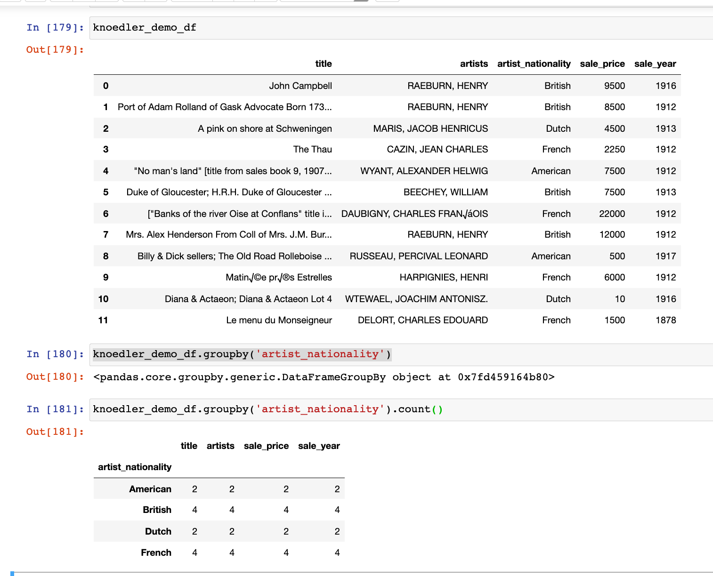
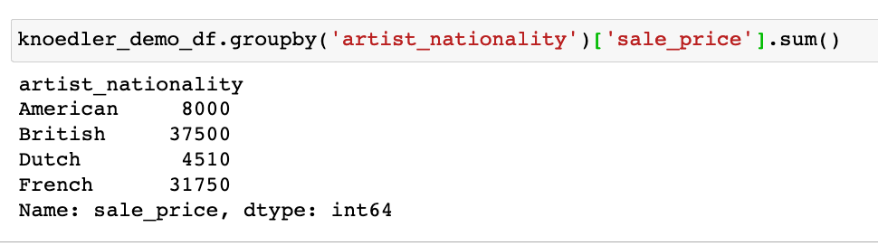
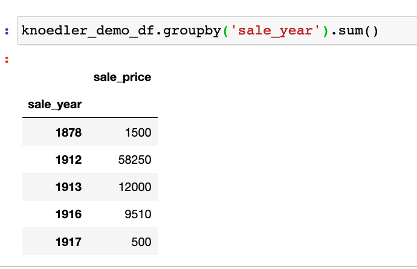
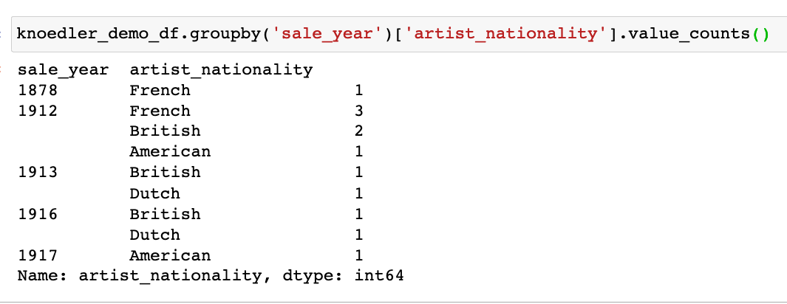
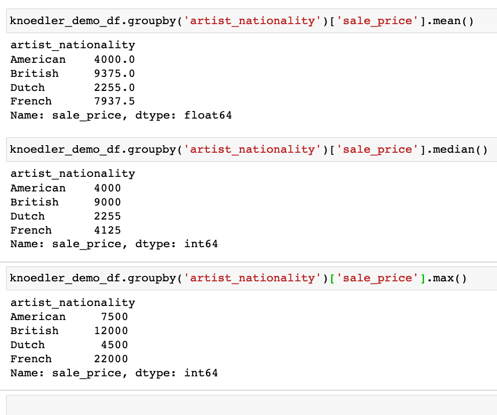
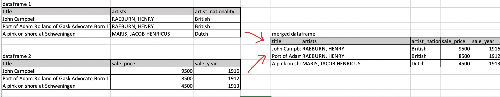

# Homework 5: Hunches, Hypotheses, and Exploratory Data Analysis

So far we've learned how to think about datasets in all of their rich contexts, how turn sources into datasets, and how to collect data by hand and through webscraping tools like OpenRefine. We've also learned the basics of Python commands, Jupyter notebooks (a file format for sharing Python code), and Pandas (a specific Python library for analyzing tabular data).

In this week's homework, we're going to put some of this together. We're going to practice turning specific research questions into hunches that we can test out using what we've learned so far in pandas. Working with a single dataset,  we're going to translate some research questions into concrete analytical tasks that we can measure, count, analyze with the assistance of simple computational scripts. **This homework will set up the first part of this: We'll complete together in class.**

## Let's refresh ourselves on what we've learned!

Take a few minutes to refresh yourself and try and try and answer the following questions (no need to record your answers, this is just for you)

- Jupyter notebooks
	- How do we make a Jupyter notebook? open it? rename it? save it? how do we import Pandas?
- Pandas
	- How do we read in a csv? what is a dataframe? what is a column (or "series")"? how do we select columns and rows? how do we rename columns or create new ones?
	- How do we sort data? how do we filter data? how can we drop data? how can we aggregate data?

If it helps, look back at the sequence of our lessons on these topics: 

- Videos on using Jupyter notebooks:
	- [How to run a Jupyter notebook on Anaconda Navigator](https://princeton.zoom.us/rec/share/1uLtbi2UisC7Pl3ahYY8ZPEOpEvmV1xQpnPFVtze6DLDL9jrSQLEqZvlWx2r1XZT.7t57DUBTKoWewi-a?startTime=1614894075000)
	- [Pro tips for using Jupyter notebooks (and some additional pandas tips)](https://princeton.zoom.us/rec/share/I7cTIhAELXlhL1mBVjuO12oYSFhy6g_ODaKPR_f23QEy5XXua-qzk2e_EwAwCkVh.Wrkvl1Em98fRXe1j?startTime=1614896446000)
- Python and pandas in class practicums and homework: 
	- [Exploring a Dataset through its Metadata](https://github.com/sceckert/IntroDHFall2022/blob/main/_week3/introduction-to-metadata.ipynb)  [[interactive version]](https://mybinder.org/v2/gh/sceckert/introdhFall2022/main?urlpath=lab/tree/_week3/introduction-to-metadata.ipynb)
	- [Introduction to Python Basics](https://github.com/sceckert/IntroDHFall2022/blob/main/_week4/introduction-to-python.ipynb)  [[interactive version]](https://mybinder.org/v2/gh/sceckert/introdhFall2022/main?urlpath=lab/tree/_week4/introduction-to-python.ipynb)
	- [Homework 4: Working with Data in Python](https://github.com/sceckert/IntroDHFall2022/blob/main/_week4/homework-4.ipynb)  [[interactive version]](https://mybinder.org/v2/gh/sceckert/introdhFall2022/main?urlpath=lab/tree/_week4/homework-4.ipynb)
	- [Introduction to Python (Continued)](https://github.com/sceckert/IntroDHFall2022/blob/main/_week4/introduction-to-python-continued.ipynb) [[interactive version]](https://mybinder.org/v2/gh/sceckert/introdhFall2022/main?urlpath=lab/tree/_week4/introduction-to-python-continued.ipynb) 
	- [Introduction to Pandas: Using Python to read & explore tabular data](https://github.com/sceckert/IntroDHFall2022/blob/main/_week5/python-continued.ipynb) [[interactive version]](https://mybinder.org/v2/gh/sceckert/introdhFall2022/main?urlpath=lab/tree/_week5/python-continued.ipynb)

## More Advanced Pandas

There are a few more advanced pandas techniques that will come in handy for today's homework and for our in-class work on Thursday.

### Refrefsher on `groupby()` 

`groupby()` as we've learned in early lessons on pandas, is a powerful operation that allows us to to sort data 

Pandas documentation for using groupby [https://pandas.pydata.org/pandas-docs/stable/user_guide/groupby.html]

For instance, take this small sample data from the NYC Knoedler dataset. We can create dataframe from the CSV:

`knoedler_demo_df = pd.read_csv('../_datasets/knoedler-art-auction-dataset/nyc_knoedler.csv', encoding='utf-8')`

`knoedler_df`_ 

We could run `groupby('artist_nationality).counts()` to count the number of non-NaN rows with each given artist nationality (remember, `counts()` counts only rows with values in them)

Or we could group by "artist_nationality",  filter by "sale price", and calculate the TOTAL value of artworks sold by artists of each given nationality.

Or we could group by "sale_year",  filter by "sale_price", and calculate the TOTAL value of artworks sold in each year.

Or we could group by "sale_year",  filter by "artist_nationality", and calculate the number of paintings sold by artists of each nationality in each year. 

Or we could could group by "artist_nationality", filter by "sale_price"  and calculate the mean, median, and maximum sale prices  for artworks for each nationality

### `merge()` 

Sometimes your research data will be spread out across several different CSV files. Luckily enough, pandas has the capacity to bring different data frames into a single dataframe. The `merge()` operation allows us to combine two different data frames by "merging" along a shared key.

For instance, if we had two data frames, `dataframe1` and `dataframe2`, each of which shared a single column in common (a "key" column), we can merge on that column.

`pd.merge(dataframe1, dataframe2, on='title')`

### `plot()` 

We've already seen some and pandas plotting functions (see, for instance, the functions in [Introduction to Pandas, Exercise 2](https://mybinder.org/v2/gh/sceckert/introdhFall2022/main?urlpath=lab/tree/_week5/python-continued.ipynb) )

The plot function has several basic plotting operations operations. Skim through the plotting documentations to learn more about how to create the different kinds of visualizations: stacked bar charts, scatter plots, chart, etc: [https://pandas.pydata.org/pandas-docs/stable/user_guide/visualization.html](https://pandas.pydata.org/pandas-docs/stable/user_guide/visualization.html) We'll be talking much more about critical practices in data visualization later in the semester.

### `describe()`

To generate some basic statistics on the distribution and dispersion of values in our dataset (excluding NaN values), we can use the `describe()` function.

Take a look at the "Notes" and "Examples" section in the pandas guide: [https://pandas.pydata.org/pandas-docs/stable/reference/api/pandas.DataFrame.describe.html](https://pandas.pydata.org/pandas-docs/stable/reference/api/pandas.DataFrame.describe.html) 

### `corr()`

Sometimes we want to measure how related two sets of numerical data are to one one another (for instance, the relationship between the purchase price and sale price in a dataset of nineteenth-century art auction data). We can use the pandas `corr()` function to generate a a statistical hypothesis about a dataset and test that hypothesis. 

The first step in generating a hypothesis is making an assumption: is this going to rough follow a *linear* relationship, or some other kind of relationship? 

For test the linear correlation of two given variables, we can use the `corr()` method to get a sense of the type of linear relationship there is in the data––is it a it a positive one(if variable 1 goes up, variable 2 does as well), or a negative one (if variable 1 goes up, variable 2 goes down)––and the strength of that relationship (weak, strong, or none).

The general format for a linear, Pearson's correlation test in pandas: `df[['variable1, 'variable2']].corr(method='pearson)` 

For instance, let's say I wanted to see if there was a correlation between the purchase price and the sale price of 
`knoedler_df[['purchase_price, 'sale, price']].corr(method='pearson')` we get a correlation coefficient of 0.31924

we find that there is a weak positive relationship between the purchase price and sale price.

If you explore the pandas, you'll see that you can change the method for correlation from `method='pearson'` to  other methods of correlation testing: Spearman's [`method='spearman'`](which measures correlation in ranked data) and Kendall's tau [`method='kendall'`](which is a non-paramedic measure of ranked correlation). Take a look at [how these can be used in the pandas user guide](https://pandas.pydata.org/pandas-docs/stable/reference/api/pandas.DataFrame.corr.html) Note that these tests are a little more complicated than Peason's correlation coefficient.

#### A word of caution about correlation

+  Any good statistician will tell you that correlation does not equal causation! Just because you find a correlation between two variables does not mean one caused the other.

+ Correlations metrics do very poorly when we have small amounts of data (they can be very sensitive to outliers) 

What are we actually measuring when we calculate "correlation"? The technique was developed by Charles Darwin's erstwhile cousin, Francis Dalton, who first arrived at the method as a way of describing heredity. Studying the French statistician Alphonse Bertillon's records on family features, Galton found himself walking backwards into a method for analyzing the statistical relationship between two sets of data when he was trying to develop a statistical description of the process of heredity. Karl Pearson took up the math and developed the mathematical formula for correlation that we now call "Pearson's correlation coefficient," which measures the covariance (how closely any two variables change together) of two variables divided by the product of their standard deviations. I say this not to suggest that we never use correlations, but that we understanding that correlation metrics work by presuming certain aspects of the underlying data (namely, that it follows certain linear characteristics). Correlation may tell us that two variables are related, but they do not tell us why, or the direction of that relationship.

(For more about the history of mathematical statistics, see chapter 9 of Theodore Porter's *The Rise of Statistical Thinking, 1820-1900* (1986) or chapter 1 in Wendy Chun's *Discriminating Data: Correlation: Neighborhoods, and the New Politics of Recognition* (2021) )

## Part 1: From exploratory data analysis to a research hypothesis

For this exercise, we're going to be working with the film dialogue dataset behind *The Pudding'*s 2017 article, ["Film Dialogue from 2,000 screenplays, Broken Down by Gender and Age"](https://pudding.cool/2017/03/film-dialogue/)

Read up on background behind the choices in the "Film Dialogue, By Gender" project here: [https://medium.com/@matthew_daniels/faq-for-the-film-dialogue-by-gender-project-40078209f751](https://medium.com/@matthew_daniels/faq-for-the-film-dialogue-by-gender-project-40078209f751)

### Getting set up

1. Download the three datasets from [this zip file](https://github.com/sceckert/IntroDHFall2022/blob/main/_datasets/pudding-film-dialogue-data.zip?raw=true). These scripts are from Matt Daniels's [Github repo](https://github.com/matthewfdaniels/scripts/). Take a look inside the documentation files to see what each contain
2. Launch Anaconda Navigator, Launch JupyterLabs and create a new Jupyter notebook 
3. Read in each of the CSV files as a dataframe. This particular *Pudding* data has a slightly different encoding, so make sure to specify `encoding = "ISO-8859-1")` when you load them in, like so: `df = pd.read_csv('../path/to/the/file/', encoding='ISO-8859-1`). 
	- You should create THREE separate pandas DataFrames, one for the character_list data, one for the character_mapping data, and one for the public_scripts data.
4. Once you've loaded in each CSV, and created each DataFrame take a look at what you find in each of them. See if there is any missing data, what kinds of data is present in each, what kind of values appear, what are their ranges and distributions, etc

### Planning how to translate research questions into specific computational tasks (eg specific things to measure, count, explore)

These datasets were originally created for a specific set of research questions about gender and dialogue in films, but there's enough data here that we could think about other research questions we could ask.

Think about how you would answer the following questions. Write down some thoughts in plain English (not Python) describing in layman's terms what you would have to do answer these questions: 

1. How could we tell if the amount of dialogue (by gender breakdown and total) in a given movie, was increasing over time in our movies dataset? How might this influence the assessment about the breakdown of gender dialogue?
2. How could you test if there was any relationship between the film's gross value and the amount of dialogue in the film?

If you want, you can try to take a stab at outlining what kinds of Python commands you might use.

### Generating a hypothesis & testing it

1. How would you visualize one of the research questions above? What variables would we plot and how? (In plain English)
2. What do you *hypothesize* your visualization would look like? 

### Reflections

How is a research question different from a testable, exploratory hypothesis? Reflect on how you had to change your research question in order to turn it into something that you could test out or explore computationally  

1. What other research questions would you want to explore in this dataset?
2. How could you turn those research questions into testable hypotheses?

Part 2 we will complete together in class!