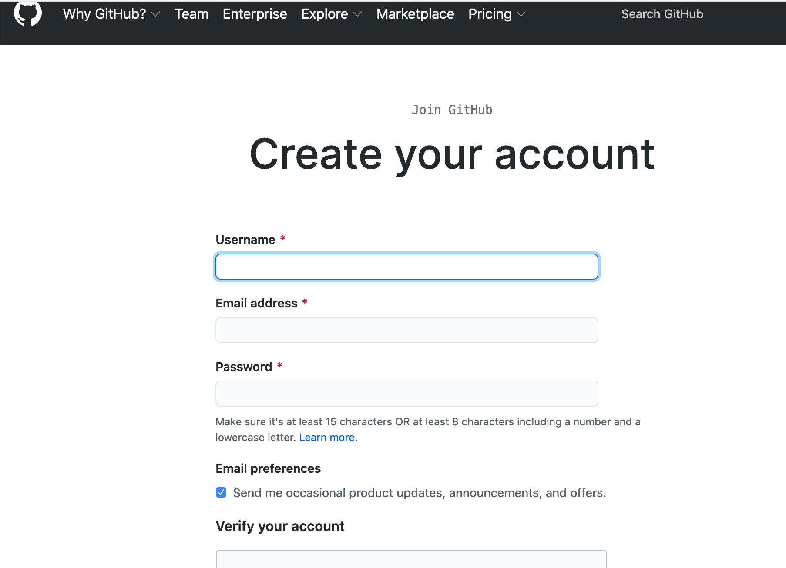

# Homework 6: Introduction to Text Analysis

### What is Text Analysis?

Text analysis (also called “text mining” or “distant reading"-–a phrase coined in 2000 by Franco Moretti): is a term for research techniques that analyze information based on statistical patterns in texts. This can be as simple as counting the raw frequencies of works, or using statistical "modeling" of textual language.

We've already dipped our toes into text analysis when we [used the command line commands to find keywords in a set of texts](https://github.com/sceckert/IntroDHFall2022/blob/main/_week2/introduction-to-the-command-line.md#analyzing-text-files) and when we [used a Python script to extract word frequencies from inaugural addresses](https://github.com/sceckert/IntroDHFall2022/blob/main/_week4/introduction-to-python.ipynb). Other common, out-of-the box tools for lightweight text analysis include [Voyant Tools](https://voyant-tools.org/), which is a web-based environment for analyzing patterns in small collections of text files (like tracing word counts over a corpus, looking). Text analysis will often draw on methods from **natural language processing (NLP)** "a field that explores the interactions between computers and human (natural) languages."([Digital Humanities Literary Guidebook](https://cmu-lib.github.io/dhlg/topics/))

For today's homework, we'll explore some of more complicated things that scholars are using to analyze texts:

1. Explore existing tools for text analysis
2. Read about more advanced methods of "distant reading" collections of texts
2. Sign up for a GitHub account (which we'll be using in our in-class work)

## Step 1. Text Analysis with Voyant Tools

Complete the [simple walk through of Voyant tools](Voyant-Tools-tutorial.pdf)

## Step 2. Choose ONE of the following text analysis tutorial to read 

1. Choose one of the following tutorials; 
- Matthew Lavin,[ "Analyzing Documents with tf-idf"](https://programminghistorian.org/en/lessons/analyzing-documents-with-tfidf) (2019)
- Zoë Wilkinson Saldaña, ["Sentiment Analysis for Exploratory Data Analysis"](https://programminghistorian.org/en/lessons/sentiment-analysis) (2018)
- Digital Research Institute (DRI), ["Introduction to Text Analysis with Python and NLTK""](https://github.com/DHRI-Curriculum/text-analysis) (2018)

2. Write down one question that you have after reading the tutorial.
 
*NOTE:* Your goal should be to read through the tutorial to get a sense of what your chosen method does, its limitations and advantages. This means:

1. You don't need to complete the actual steps of the tutorial (unless you want to)
2.  You should read the tutorial with an eye towards what this methods does, how it works (in plain English, not the minutia of the Python code)
	- Ex: What sorts of research questions we can (and can't) responsibly use it to explore, and what other considerations we might have to take into account when using it.

## Step 3. Sign up for GitHub account

1. Read Imran Haider's (5 minute-read) ["A Dead Simple Intro to GitHub for the Non-Technical"](https://medium.com/crowdbotics/a-dead-simple-intro-to-github-for-the-non-technical-f9d56410a856) 

2. Finally, sign up for a GitHub account:
	- Go to github.com and click [sign-up](https://github.com/join?ref_cta=Sign+up&ref_loc=header+logged+out&ref_page=%2F&source=header-home)
	

## Optional: Finish in-class assignment from last week

Try and finish the assignment we worked on [in class](https://github.com/sceckert/presentations/blob/master/slides/IntroDH-F22-wk7-thu.md) and as part of your [homework last Thursday](https://github.com/sceckert/IntroDHFall2022/blob/main/_week7/homework-5.md). If you find yourself getting, stuck, take a look at [my notebook](https://github.com/sceckert/IntroDHFall2022/blob/main/_week7/exploratory-data-analysis-with-pandas.ipynb) ([interactive Binder version here](https://mybinder.org/v2/gh/sceckert/introdhfall2022/main?urlpath=lab/tree/_week7/exploratory-data-analysis-with-pandas.ipynb)) 

I'm not requiring you to turn this in, but if you'd like feedback, include it as part of your Week 8 homework.

If you want further guidance on downloading files from our course website, here are my [instructions how to download web resources using `wget`](https://github.com/sceckert/IntroDHFall2022/blob/main/_week8/using-wget.md)

> NOTE: to view the interactive visualization, you will have to open the Jupyter notebook in "Jupyter Notebook,"" not Jupyter Labs. To do this, launch Anaconda Navigator, and, from the menu, select "Jupyter Notebook" (not Jupyter Labs).

