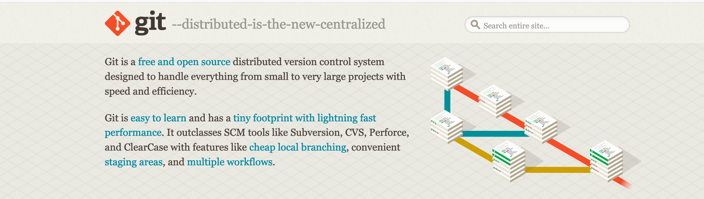
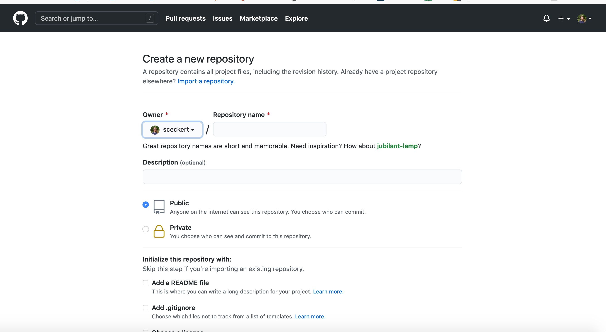
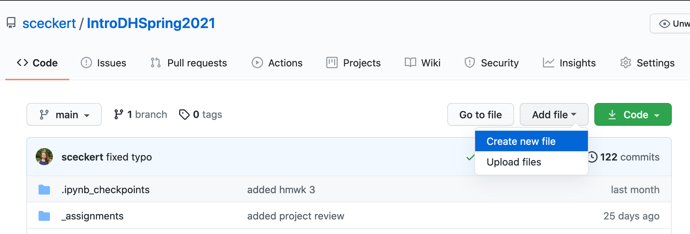

# Week 8: Text Analysis, Intro to Git and GitHub

## Introduction to Git and GitHub

Note:
Why should we care about version control? 
	- The problem of duplicate versions:
	- Ex: File1-final-new-final-FINAL3.2-201-new.docx
	- the GoogleDocs version
		- works best at that point in time
		- but difficult to move between versions 
- ENTER, Github
	- Git emerges from software engineering as a version control system
	- Effort to track WHAT changes were made, WHO made them, WHEN and WHY they were made
- How does Git work?
	- Git works by repositories that contain both the files of a project and the full revision history of those files, along with your comments on those revisions
	- Git = a log, a ledger of what you've done
	-  There are three layers
		-  The file system
		-  A staging area
		-  An official record or log
	-  To add a revision of files, 
		-  make your changes to the file system
		-  add them to the staging area
		-  then commitment them into the log, along with some annotations describing what you did

### Git commands

Local commands:

- `git init` sets up git in a directory

- `git add [name_of_file]` add files to the staging layer
 	`git add .` will add *all* the current changed files to the staging layer

-  `git commit -m "your message"` adds your staged changes to git (your official log) along with message describing what you've done, eg
	`git commit -m "a message describing what you've done"`

Next layer: remote server

-  `git push` takes a version on your local machine and synchronizes it with a remote server (i.e. GitHub, the free host for git) 

-  `git pull` takes a version on the remote server and pulls it to your local system

### Using Git

The first thing you should do when you install Git is to set your **user name** and **email address**. This is important because every Git commit uses this information, and it’s immutably baked into the commits you start creating:

- To set your username and email address
  <pre><code>
	 git config --global user.name "John Doe"`
	 git config --global user.email johndoe@example.com
  </code></pre> 
- To check your settings: 
  <pre><code>
	git config --list
  </code></pre> 

- To set the name of your main "branch", as "main", type:
  <pre><code>git branch -M main </code></pre>
- To check the status of your different layers:
  <pre><code>
	git status
  </code></pre> will tell you what is happening in that directory and where you are

### Authenticating your GitHub account on your local machine

NOTE: As of April 2021, GitHub is phasing out access by password to your remote account.

In order to be able to "push" and "pull"  from your remote GitHub account, you will need to set up a **personal access token**.

Follow the instructions in the GitHub docs for [creating a personal access token](https://docs.github.com/en/github/authenticating-to-github/creating-a-personal-access-token)

Once you've created your token, you will use the TOKEN instead of your account password when prompted by git.

### Using Git

- Open your command line
- Make a directory
- Move into that directory
- Let's initialize versioning in this directory. Type <pre><code> git init </code></pre>
- Rename our main branch <pre><code>git branch -M main </code></pre> 
- Create a file called `test1.txt`
- Now, type <pre><code> git status </code></pre> What do you see?
- Type  <pre><code> git add text1.txt</code></pre>
- Now, type <pre><code> git status </code></pre>

- Create another two files, test2.txt and test3.txt. 
- Stage only test3.txt  <pre><code> git add text3.txt</code></pre>
- Now, run 
	- <pre><code> git commit -m "Today I added test1 and test3 to my repo"` </code></pre>
	- The `-m` flag says put notes in line with command
- What happens if you change a file after you change it?

Note:
You have to stage it again (the earlier version of test2 is still there) in order to have a later version.

## Using GitHub

### 

### To add material to GitHub from your local machine:

- Login to your GitHub Account
- Click on "Repositories"
- Click "New" to create a new repository

- Give your new repository a short name

- From the new page, you should see a URL with a link to your repo. Copy it 
	- You can access this later via the green Code button) "Clone" button. 

- From the command line, move back into the directory with your test files
- Connect to the repository by adding it with <pre><code> git remote add origin URL-OF-YOUR-GITHUB-REPOSITORY</code></pre>
- We will now use `git push`. Type <pre><code> git push -u origin main </code></pre>
	- NOTE: For the first time push to a Github repo, our push command includes <pre><code> -u origin main </code></pre> which tells us where in the repo to push to. All later times you push, the command is just git push

- Navigate back to your GitHub repo
- What do we see?

- Make more changes to test2.txt.
- Stage them <pre><code> git add .</code></pre>
- Then, run <pre><code> git commit -m "my changes to test2"</code></pre>
- Push the changes to the directory with <pre><code> git push</code></pre>

Note:
When GitHub compares versions, it is a line-by-line comparison. For this reason must be plain text

## To download new changes from your GitHub repo to your local machine

- Navigate to your repository on GitHub
- Add a new file, test4.txt

- Click the "commit" button, leaving a message

- From the command line, type <pre><code> git pull </code></pre>
- What do you see?

## To download another user's GitHub repo

- Navigate to the repository you want to download, and click "Clone" to get the repo URL.
- Open the command line, 
- Move to a directory that you'd like to download the repo files into
- Type <pre><code> git clone URL-OF_GITHUB_REPO</code></pre>

## To add a collaborator to your remote repository

- Navigate to the repo on GitHub
- Click the "Settings" icon (a gear)
- In the lefthand menu, click "Manage access"
- Scroll down to invite a collaborator
- This will allow you both to pull and push to a repo without having to make a "fork" (a copy of the repository) and pull request

## Authoring on GitHub

### Markdown

GitHub is not just a space for putting code, you can also display formatted text in a mark-up language called Markdown. 

You've probably seen that many of our class materials end in a `.md` file format. These are plain text files written **Markdown**.

You can write Markdown files on your browser: open up Notepad (Or TextEdit, or Atom or BBEdti -- whatever plain text editor you prefer), and save your file with a .md extension.

#### What does Markdown syntax look like?

GitHub provides a [quick guide to writing in markdown](https://guides.github.com/features/mastering-markdown/). It features examples.

There is also a [reference sheet](https://kramdown.gettalong.org/quickref.html) with flavor of Markdown language that GItHub supports. 

### Jupyter notebooks & Markdown

Markdown is also the language used in the prose portions of our Jupyter notebooks. You can use the same kind of Markdown you use in a Markdown file in a jupyter notebook (just make sure to change the cell from Code to Markdown)

