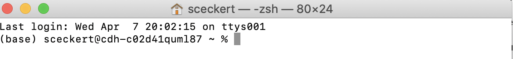

# Topic Modeling - Getting Set-Up

*Adapted from Melanie Walsh's guide to [Topic Modeling with Python.](https://github.com/melaniewalsh/Intro-Cultural-Analytics/blob/master/book/Text-Analysis/Topic-Modeling-Set-Up.ipynb)* 

The method of text analysis that we'll be using in class is the probabilistic method called "topic modeling." In class, we got a chance to try out topic modeling and the topic modeling browser designed by David Mimno here: 

Often, we'll want to have a little more control over the data produced by a topic model, so that we're able to create our own visualizations of the data. 

These steps below will walk you through what you'll need

***IMPORTANT NOTE:*** 
If you want to topic model without installing anything, however, you can skip ahead and explore these Jupyter notebook topic modeling lessons in the cloud in our Binder Juypter notebooks. The notebooks already have the necessary requirements installed.

## MALLET

We talked about **MA**chine **L**earning **L**anguag**E** **T**oolkint ([MALLET](http://mallet.cs.umass.edu/index.php)) in class. It's a statistical package for running an unsupervised model over a collection of texts.

Because MALLET is written in Java, we need to install Java and a special library called a "wrapper," which will allow us to use code written in one programming language (Java) within another programming language (Python). So were' going to install Java, MALLET, and a wrapper that will allow us to run MALLET from within our Python-based Jupyter notebooks.

## Step 1: Download and Install Java Development Kit

Go to the Java Development Kit download page, find your operating system, and click on the corresponding download link: https://www.oracle.com/java/technologies/javase-jdk14-downloads.html

Choose the most recent JDK (currently JDK 16) and click "JDK Download." This will take you to an installation page. Choose the appropriate file to download: 

- For Mac: macOS Installer
- For Windows:  Windowsx64 Installer
- For Linux: Windowsx64 Installer

Then open or unzip the file and follow all the instructions to complete the installation.

## Step 2: Tell your computer where to find Java

Now we have to tell our computers where to find JDK. For Macs, this involves defining a new variable, called JAVA_HOME and give it the filepath of our new JDK. For Windows, we edit a PATH variable to include the file path of JDK.

### For Mac

Open up your Terminal. Check whether the language at the top is "bash" or "zsh"

 - If the top of your command prompt shell says "bash"....
	-  You can run the following on the command line to set up the JAVA_HOME environment variable. The line of code adds your JAVA_HOME variable to a file called “bash_profile”, which is where environment variables are stored. `!echo "export JAVA_HOME=$(/usr/libexec/java_home)" >> ~/.bash_profile`
	-  Then, to immediately update your "bash profile", run: `source ~/.bash_profile`
	-  Then, to test whether Java correctly installed, type `javac`. If you get a list of options, you correctly installed it. If your command line says "Not recognized," then it is not correctly installed.
-  If the top of your command prompt shell says "zsh"...
	-  You can run the following on the command line to set up the JAVA_HOME environment variable. The line of code adds your JAVA_HOME variable to a file called “zshrc”, which is where environment variables are stored. `echo "export JAVA_HOME=$(/usr/libexec/java_home)" >> ~/.zshrc`
	-  Then, to immediately update your "zshrc", run: `source ~/.zshrc`
	-  Then, to test whether Java correctly installed, type `javac`. If you get a list of options, you correctly installed it. If your command line says "Not recognized," then it is not correctly installed.

### For Windows

To edit the PATH variable on a Windows computer, follow the instructions below:

- Open Search and type "advanced system settings"
- In the shown options, select the "View advanced system settings" link
- Under the Advanced tab, click "Environment Variables"
- Under "System variables," click the variable "PATH" and then click "Edit"
- Click "New" and add the file path to the JDK (e.g. `C:\Program Files\Java\jdk13.0.2\bin`)

Now restart your PowerShell. To test whether java is installed, run the command `javac`  in the PowerShell. If you get a list of options, then you’ve installed the JDK properly. If it says the command is not recognized, then you don’t have it yet.

### For Linux/Chromebooks
To set up the JAVA_HOME environment variable on a Linux machine or a Chrome computer running Linux, you can run the following on the command line. The line of code adds your JAVA_HOME variable to a file called “bashrc”, which is where environment variables are stored.

Make sure to change /fill-in-the-path/to/your-java_installation to the file path where your JDK actually exists below:

`echo "export JAVA_HOME=/fill-in-the-path/to/your-java_installation/bin" >> ~/.bashrc`

To immediately update your “bash_profile,” run: `source ~/.bashrc`

Then, to test whether Java correctly installed, type `javac`. If you get a list of options, you correctly installed it. If your command line says "Not recognized," then it is not correctly installed.

## Step 3: Download and Unzip MALLET
To download MALLET, click the following [link](http://mallet.cs.umass.edu/dist/mallet-2.0.8.zip) or find the link on the [MALLET home page.](http://mallet.cs.umass.edu/index.ph) Once the zip file downloads, unzip it.

- **If you’re using a Mac**, move the “mallet-2.0.8” directory into your home folder.
	- Note: To open your “home” folder, open “Finder” and type Cmd + Shift + H. To move one directory up, type Cmd + ↑. Now, if you want to bookmark your home folder so you can find it more easily in the future, simply drag and drop your home folder to the sidebar.
- **If you’re using a Windows computer**, move the “mallet-2.0.8” directory int your C:\ drive.
	- Windows users: you need to complete one more step. You need to once again tell your computer where MALLET is located:
		- Open Search and type “advanced system settings”
		-  In the shown options, select the View advanced system settings link
		-  Under the Advanced tab, click “Environment Variables”
		-   In the User variables section, click “New”
		-    For the Variable name, type MALLET_HOME. For the Value, type the path to your MALLET: C:\mallet-2.0.8. Then click OK
		-     Click OK and click Apply to apply the changes

 To test whether MALLET works on your computer, type in the file path for MALLET on the command line and import-file, like so:

- Mac:  `~/mallet-2.0.8/bin/mallet import-file` 
- Windows: `C:\mallet-2.0.8.\bin\mallet import-file`

If it’s working, then you’ll get a message that says “A tool for creating instance lists of feature vectors from comma-separated-values” and a list of options.

## Step 4: Install Little MALLET Wrapper

Finally, we’re going to install the Python package [little_mallet_wrapper](https://github.com/maria-antoniak/little-mallet-wrapper). To install it, run pip install little_mallet_wrapper, as below.

`pip install little_mallet_wrapper`

Since Little MALLET Wrapper also uses the data visualization library seaborn, we’re also going to pip install seaborn:

`pip install seaborn`

YOU'RE ALL SET!! 